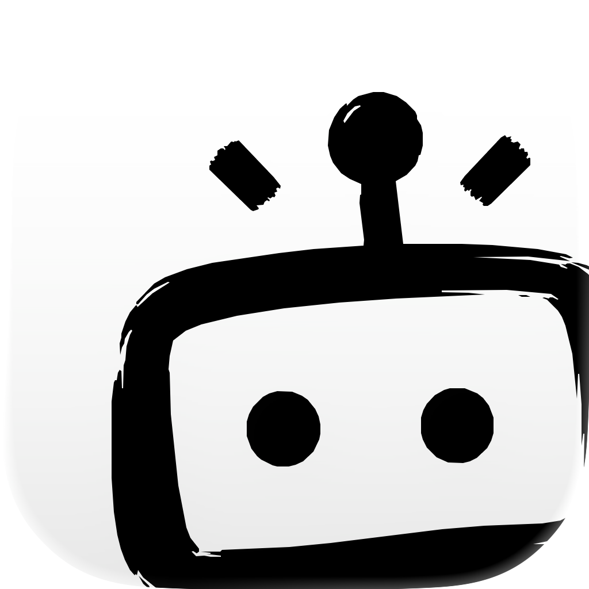

<div align="center">



# TabTin

**让人和 Agent 共同工作，让个人完成的工作成为团队能力。**

[官网](https://tabtin.com/) · [快速开始](#开始使用) · [源码开发](#本地开发) · [贡献](CONTRIBUTING.md) · [安全](SECURITY.md)

中文 | [English](README.en.md)

</div>

> Public Preview：TabTin 正在进行首次完整公开发布。不同组件的成熟度可能不同，请以公开文档和实际验证结果为准。

TabTin 是一个开源的人与 Agent 协作平台，面向希望把 Agent 带进真实工作的个人和团队。开发者可以自托管、扩展并参与建设这套平台。

> 我们希望工作因此更轻松，协作更顺畅，任务推进更清晰；每个人的工作被看见、判断被理解、贡献有据可验。

## 为什么做 TabTin

AI 提高了个人产出，却没有自动提高团队效率。

当团队开始深度使用 Agent，每个人不同的使用方式会带来新的协作成本：好的工作方法难以复用；任务换人后需要重复调研；大量 Token 消耗在重新理解同一件事；最终文档看得见，背后的判断和取舍却容易丢失；Agent 产出了很多内容，也未必有人真正对结果负责。

TabTin 首先想解决的是：**一个人已经完成的工作，能不能直接成为下一位同事的起点？**

深度使用 AI 的团队是 TabTin 最初切入的人群，但不是产品边界。TabTin 面向所有希望把 Agent 带进真实工作的个人和团队。

## TabTin 的协作方式

### 工作可以交接

交接的不只是最后一份文档，还可以包括 Agent 任务、必要的对话上下文，以及主动选择共享的文档和附件。接手人能够理解结论怎样形成，并在自己的 Agent 和 Workspace 中继续推进。

每个人的本地文件和执行环境仍然相互独立，但已经完成的调研不必重做。

### 人和 Agent 操作同一份结果

TabTin 提供消息、文档、多维表格和演示文稿等协作应用。Agent 可以直接创建和编辑这些内容；浏览器采集到的数据与媒体也可以继续进入工作应用。

人和 Agent 面对的是同一份在线结果，不需要在聊天框、文件下载和办公软件之间反复搬运。

### 团队方法可以复用

不同的 Agent 角色可以配置自己的规则、模型、Skill 和记忆。验证过的调研方法、Review 规则、测试步骤和发布流程可以在后续任务中继续使用，而不是依赖某位成员临时写出的一段 Prompt。

Agent 可以执行工作，但重要判断、责任确认和结果验收仍然由人完成。

### 团队可以拥有自己的 Agent 工作系统

TabTin 不只提供客户端，也包括服务端、Agent Runtime、实时协作、工作应用和管理能力。小团队可以直接使用客户端；希望掌握数据和运行环境的团队可以自托管；开发者也可以从源码继续修改。

我们会继续让架构更加模块化和可插拔。只有已经在公开代码中存在并经过验证的能力，才会写成当前能力；未来方向进入 [ROADMAP](ROADMAP.md)。

## 开源范围

TabTin 开放的是实际产品代码，而不是为开源单独制作的简化 Demo。

计划公开的系统包括桌面和移动客户端、服务端、Agent Runtime、实时协作、消息、文档、表格、演示文稿、模型管理和管理后台等组成部分。Public Preview 阶段的最终范围和可用状态，以发布快照及验证记录为准。

## 开始使用

你可以根据自己的目标选择入口：

1. **桌面客户端与官方服务**：适合希望先体验产品、不自行维护服务端的个人和小团队。访问 [TabTin 官网](https://tabtin.com/)。
2. **完整自托管**：适合希望掌握数据、模型配置、成员权限和运行环境的团队。
3. **源码开发**：适合希望理解架构、修改产品或参与贡献的开发者。

### Community Server 一键启动

1. **Install Docker Desktop**：从 [Docker Desktop](https://www.docker.com/products/docker-desktop/) 安装 Docker。
2. **Download TabTin source**：使用 Git clone，或从 GitHub 下载并解压源码。
3. 运行平台入口并等待 `TabTin Community is READY`：Windows 双击 `start.bat`，macOS 双击 `start.command`，macOS / Linux 终端运行 `./start.sh`。
4. 启动 **TabTin Desktop Client**。
5. 完成 **Register / Login**。
6. 在 **Settings → Model Configuration → BYOK** 中添加自己的 OpenAI-compatible 模型。
7. **Start Chat**。

未配置模型不影响后端和客户端进入 READY。macOS 可双击 `status.command` / `stop.command` 查看状态或停止，终端可运行 `./status.sh` / `./stop.sh`；所有停止入口都不会删除账号、配置和 Docker volumes。完整说明见 [Community 开源安装指南](COMMUNITY_OPEN_SOURCE_GUIDE.md)。

也可以继续使用 `./community start|logs|stop` 管理同一 Community 栈。

正式发布的安装与启动命令必须在干净环境中通过验证；如果文档与实际代码不一致，请提交 Bug。

### 本地开发

第一次从源码运行 TabTin，请先阅读[本地开发与桌面打包新手指南](docs/development/getting-started.md)。指南会按顺序说明环境准备、检查、启动、打包和常见问题。

先从无公司凭据的模板创建本地配置；`.env` 只保留在本机，不得提交：

```bash
cp .env.example .env
```

按需填写数据库、Redis、LLM、Sentry、短信、IM 和支付等配置。未配置的第三方能力默认关闭或拒绝启动，不会回退到 TabTin 的线上环境。

Windows 和 macOS 用户可以在仓库根目录直接双击对应入口：

- Windows：`start-community-dev.bat`
- macOS：`start-community-dev.command`

也可以在终端运行统一入口：

面向第一次使用者的完整 Windows/macOS 安装、BYOK 配置和首次对话流程见[社区安装与首次使用指南](docs/development/community-installation-guide.md)。

```bash
node scripts/dev.mjs community
```

中国大陆网络环境建议在终端显式选择国内下载源：

```bash
node scripts/dev.mjs community --region cn
```

双击入口默认自动选择下载源。该入口会检查开发环境、按需安装依赖、准备公开客户端配置，在后端健康后再启动 Electron。Windows 的 PowerShell、CMD 和 Git Bash 使用同一条命令，无需 Bash 或 WSL。区域选择、复用既有后端与排障方法见 [Electron 开源开发指南](apps/tabtin-electron/docs/open-source-development.zh-CN.md)；英文文档见 [Open-source Electron development](apps/tabtin-electron/docs/open-source-development.md)。

## 文档导航

- [产品概念](docs/architecture/product-concepts.md)
- [贡献指南](CONTRIBUTING.md)
- [支持入口](SUPPORT.md)
- [安全政策](SECURITY.md)
- [社区行为准则](CODE_OF_CONDUCT.md)
- [公共路线图](ROADMAP.md)
- [版本记录](CHANGELOG.md)

## 参与社区

Bug 和信息相对完整的功能需求请使用 Issue；使用帮助、开放想法和尚未成形的方向请使用 Discussions；安全漏洞请按照 [SECURITY.md](SECURITY.md) 私密报告。

中文和英文贡献都受欢迎。使用 AI 辅助贡献时，提交者仍需理解、审阅并验证自己提交的内容。具体规则见 [CONTRIBUTING.md](CONTRIBUTING.md)。

## 数据与隐私

自托管部署默认不向 TabTin 维护方回传业务数据。官方客户端的错误报告与诊断能力以公开隐私政策为准；完整诊断包只能在用户明确同意后上传。

## 许可证与商标

TabTin 的公开源码依据 [AGPL-3.0-only](LICENSE) 提供。对于无法采用 AGPL-3.0-only 的使用或分发场景，可以向 Shanghai Mofan Technology Co., Ltd. 咨询单独商业授权。

第三方组件继续适用各自的许可证，参阅 [THIRD_PARTY_NOTICES.md](THIRD_PARTY_NOTICES.md)。TabTin 名称和标识属于项目维护方的商标；分支项目可以如实说明“基于 TabTin”，但不得冒充官方版本。

Copyright © 2026 Shanghai Mofan Technology Co., Ltd.
